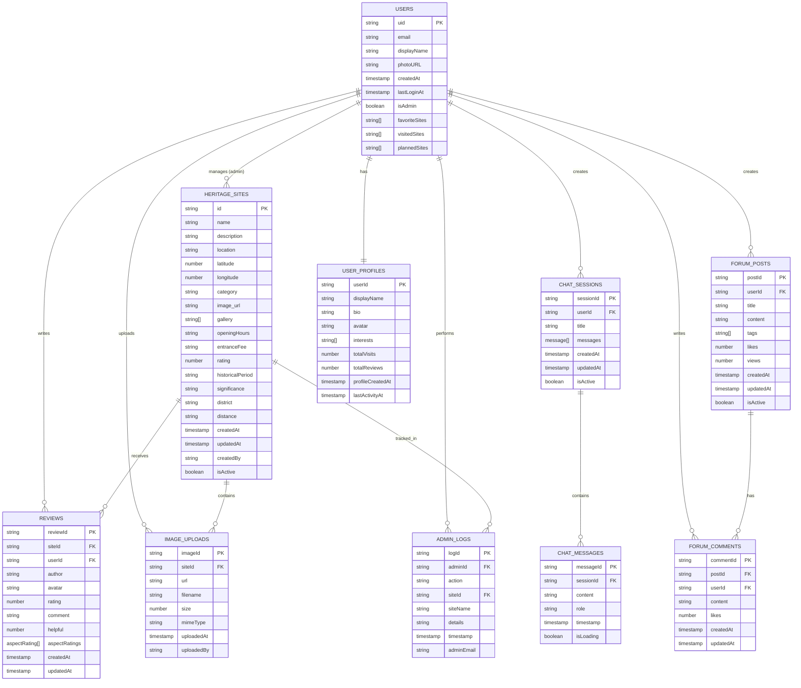
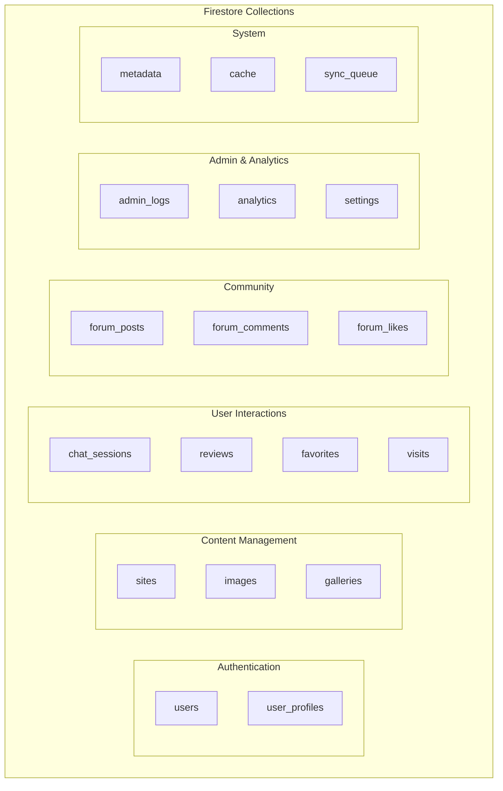
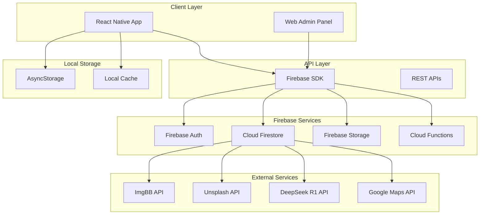
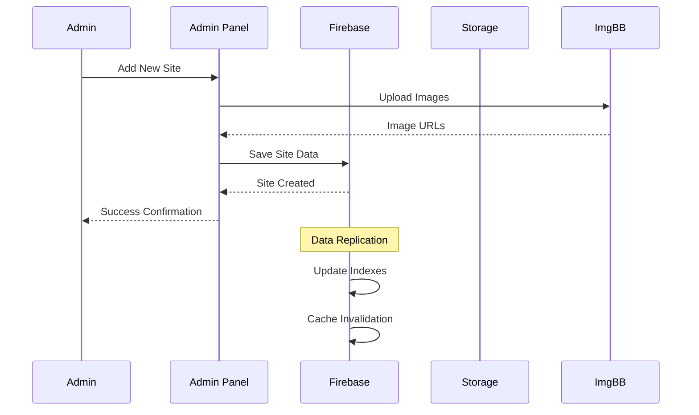
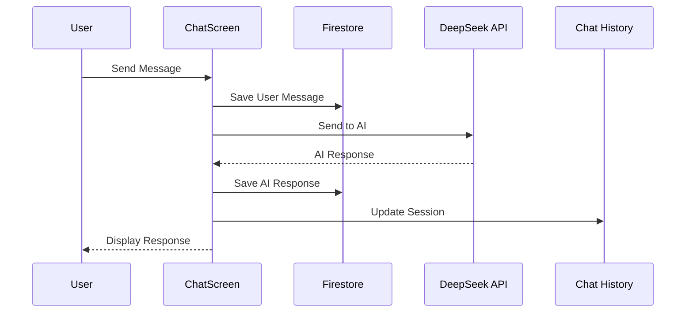
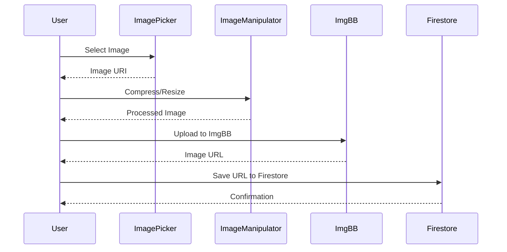
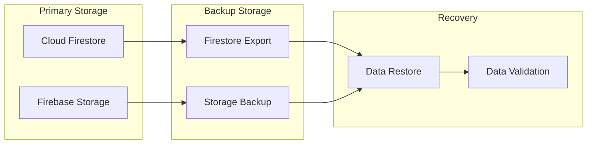
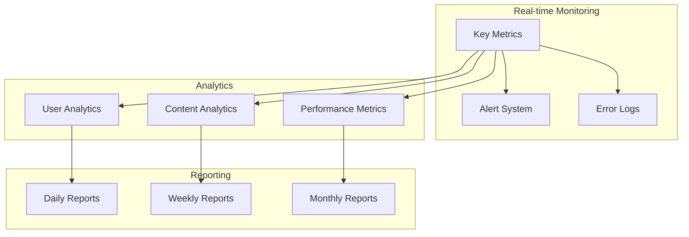

# Sri Heritage App - Database Architecture

## 1. Entity Relationship Diagram (ERD)



## 2. Firestore Collections Structure

### 2.1 Core Collections



### 2.2 Detailed Collection Schemas

#### Sites Collection
```javascript
// Collection: sites
{
  "id": "string (auto-generated)",
  "name": "string (required)",
  "description": "string (required)",
  "location": "string (required)",
  "latitude": "number (required)",
  "longitude": "number (required)",
  "category": "string (required)",
  "image_url": "string (optional)",
  "gallery": ["string"] (optional),
  "openingHours": "string (optional)",
  "entranceFee": "string (optional)",
  "rating": "number (default: 4.5)",
  "historicalPeriod": "string (optional)",
  "significance": "string (optional)",
  "district": "string (optional)",
  "distance": "string (optional)",
  "coordinates": {
    "latitude": "number",
    "longitude": "number"
  },
  "createdAt": "timestamp",
  "updatedAt": "timestamp",
  "createdBy": "string (user ID)",
  "isActive": "boolean (default: true)"
}
```

#### Chat Sessions Collection
```javascript
// Collection: chat_sessions
{
  "sessionId": "string (auto-generated)",
  "userId": "string (required)",
  "title": "string (required)",
  "messages": [
    {
      "id": "string",
      "content": "string",
      "role": "user|bot",
      "timestamp": "timestamp",
      "isLoading": "boolean"
    }
  ],
  "createdAt": "timestamp",
  "updatedAt": "timestamp",
  "isActive": "boolean (default: true)"
}
```

#### Reviews Collection
```javascript
// Collection: reviews
{
  "reviewId": "string (auto-generated)",
  "siteId": "string (required)",
  "userId": "string (required)",
  "author": "string (required)",
  "avatar": "string (optional)",
  "rating": "number (1-5, required)",
  "comment": "string (optional)",
  "helpful": "number (default: 0)",
  "aspectRatings": [
    {
      "aspect": "string",
      "rating": "number",
      "icon": "string"
    }
  ],
  "createdAt": "timestamp",
  "updatedAt": "timestamp"
}
```

#### Admin Logs Collection
```javascript
// Collection: admin_logs
{
  "logId": "string (auto-generated)",
  "adminId": "string (required)",
  "action": "add|edit|delete|login|logout|backup|settings_change",
  "siteId": "string (optional)",
  "siteName": "string (optional)",
  "details": "string (optional)",
  "timestamp": "timestamp",
  "adminEmail": "string (optional)"
}
```

## 3. Database Architecture Diagram



## 4. Data Flow Diagrams

### 4.1 Site Data Flow



### 4.2 Chat Data Flow



### 4.3 Image Upload Flow



## 5. Indexing Strategy

### 5.1 Firestore Indexes

```javascript
// Composite Indexes for Performance

// Sites Collection
{
  "collection": "sites",
  "fields": [
    { "fieldPath": "category", "order": "ASCENDING" },
    { "fieldPath": "rating", "order": "DESCENDING" }
  ]
}

{
  "collection": "sites", 
  "fields": [
    { "fieldPath": "district", "order": "ASCENDING" },
    { "fieldPath": "name", "order": "ASCENDING" }
  ]
}

// Chat Sessions Collection
{
  "collection": "chat_sessions",
  "fields": [
    { "fieldPath": "userId", "order": "ASCENDING" },
    { "fieldPath": "updatedAt", "order": "DESCENDING" }
  ]
}

// Reviews Collection
{
  "collection": "reviews",
  "fields": [
    { "fieldPath": "siteId", "order": "ASCENDING" },
    { "fieldPath": "createdAt", "order": "DESCENDING" }
  ]
}

// Admin Logs Collection
{
  "collection": "admin_logs",
  "fields": [
    { "fieldPath": "adminId", "order": "ASCENDING" },
    { "fieldPath": "timestamp", "order": "DESCENDING" }
  ]
}
```

## 6. Security Rules

### 6.1 Firestore Security Rules

```javascript
rules_version = '2';
service cloud.firestore {
  match /databases/{database}/documents {
    
    // Users can read their own data
    match /users/{userId} {
      allow read, write: if request.auth != null && request.auth.uid == userId;
    }
    
    // Sites are publicly readable, only admins can write
    match /sites/{siteId} {
      allow read: if true;
      allow write: if request.auth != null && 
        request.auth.token.email in ['admin@sriheritage.com', 'admin@sriheritage'];
    }
    
    // Chat sessions are user-specific
    match /chat_sessions/{sessionId} {
      allow read, write: if request.auth != null && 
        resource.data.userId == request.auth.uid;
    }
    
    // Reviews are publicly readable, authenticated users can write
    match /reviews/{reviewId} {
      allow read: if true;
      allow create: if request.auth != null;
      allow update, delete: if request.auth != null && 
        resource.data.userId == request.auth.uid;
    }
    
    // Admin logs are admin-only
    match /admin_logs/{logId} {
      allow read, write: if request.auth != null && 
        request.auth.token.email in ['admin@sriheritage.com', 'admin@sriheritage'];
    }
  }
}
```

### 6.2 Storage Security Rules

```javascript
rules_version = '2';
service firebase.storage {
  match /b/{bucket}/o {
    
    // Site images are publicly readable
    match /sites/{siteId}/{allPaths=**} {
      allow read: if true;
      allow write: if request.auth != null && 
        request.auth.token.email in ['admin@sriheritage.com', 'admin@sriheritage'];
    }
    
    // User uploads are user-specific
    match /users/{userId}/{allPaths=**} {
      allow read, write: if request.auth != null && 
        request.auth.uid == userId;
    }
  }
}
```

## 7. Data Backup & Recovery

### 7.1 Backup Strategy



### 7.2 Backup Schedule

- **Daily**: Automated Firestore export
- **Weekly**: Full system backup including Storage
- **Monthly**: Cross-region backup replication
- **On-Demand**: Before major updates

## 8. Performance Optimization

### 8.1 Query Optimization

```javascript
// Optimized Queries

// 1. Pagination for Sites
const getSitesPaginated = async (limit = 20, lastDoc = null) => {
  let query = collection(firestore, 'sites')
    .where('isActive', '==', true)
    .orderBy('rating', 'desc')
    .limit(limit);
    
  if (lastDoc) {
    query = query.startAfter(lastDoc);
  }
  
  return getDocs(query);
};

// 2. Geospatial Queries
const getNearbySites = async (lat, lng, radius = 10) => {
  // Use GeoFirestore or implement custom geohashing
  const sites = await getSitesFromFirestore();
  return sites.filter(site => {
    const distance = calculateDistance(lat, lng, site.latitude, site.longitude);
    return distance <= radius;
  });
};

// 3. Search with Full-Text
const searchSites = async (searchTerm) => {
  const sites = await getSitesFromFirestore();
  return sites.filter(site => 
    site.name.toLowerCase().includes(searchTerm.toLowerCase()) ||
    site.description.toLowerCase().includes(searchTerm.toLowerCase()) ||
    site.category.toLowerCase().includes(searchTerm.toLowerCase())
  );
};
```

### 8.2 Caching Strategy

```javascript
// Local Caching Implementation

class CacheManager {
  static async cacheSites(sites) {
    await AsyncStorage.setItem('cached_sites', JSON.stringify(sites));
    await AsyncStorage.setItem('sites_cache_timestamp', Date.now().toString());
  }
  
  static async getCachedSites() {
    const cached = await AsyncStorage.getItem('cached_sites');
    const timestamp = await AsyncStorage.getItem('sites_cache_timestamp');
    
    if (cached && timestamp) {
      const age = Date.now() - parseInt(timestamp);
      if (age < 24 * 60 * 60 * 1000) { // 24 hours
        return JSON.parse(cached);
      }
    }
    return null;
  }
}
```

## 9. Monitoring & Analytics

### 9.1 Key Metrics

- **User Engagement**: Daily/Monthly Active Users
- **Content Performance**: Site views, favorites, reviews
- **System Performance**: Query response times, error rates
- **Storage Usage**: Database size, storage consumption
- **API Usage**: External API calls and costs

### 9.2 Monitoring Dashboard



This comprehensive database architecture provides a scalable, secure, and performant foundation for the Sri Heritage App, supporting all current features while allowing for future expansion. 