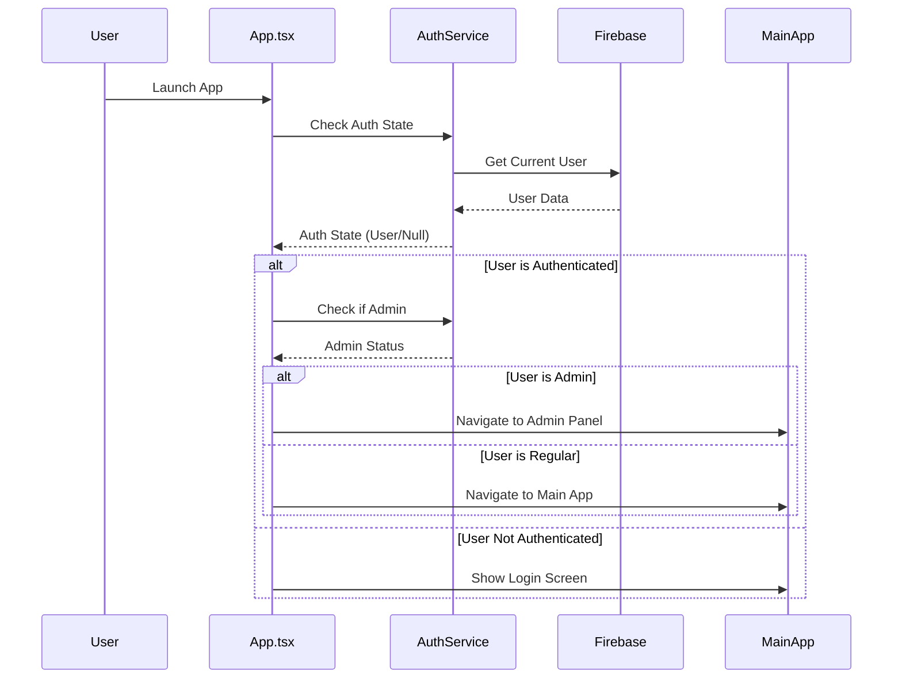
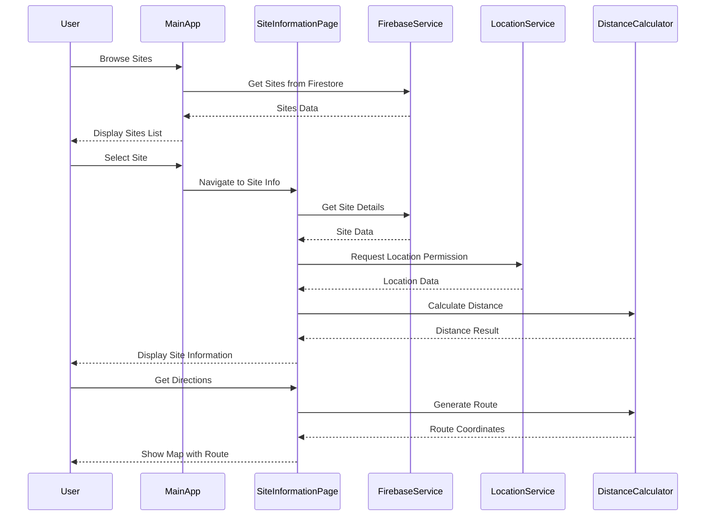
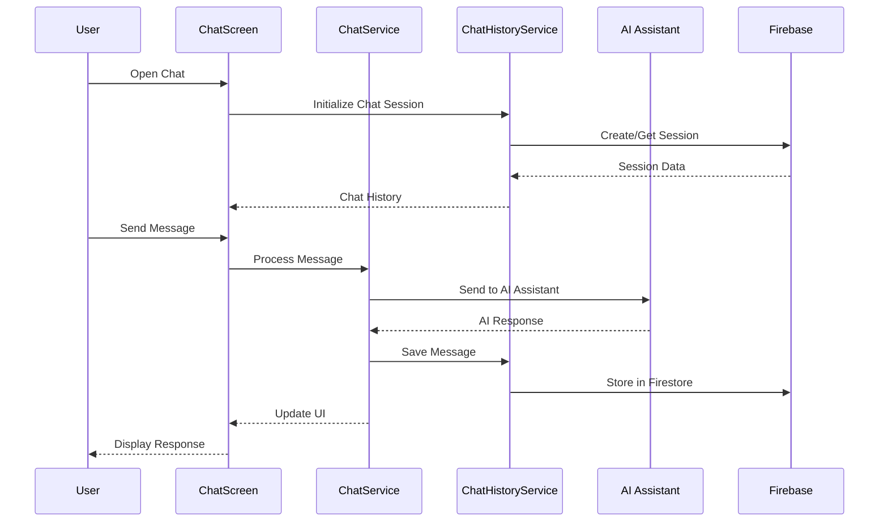
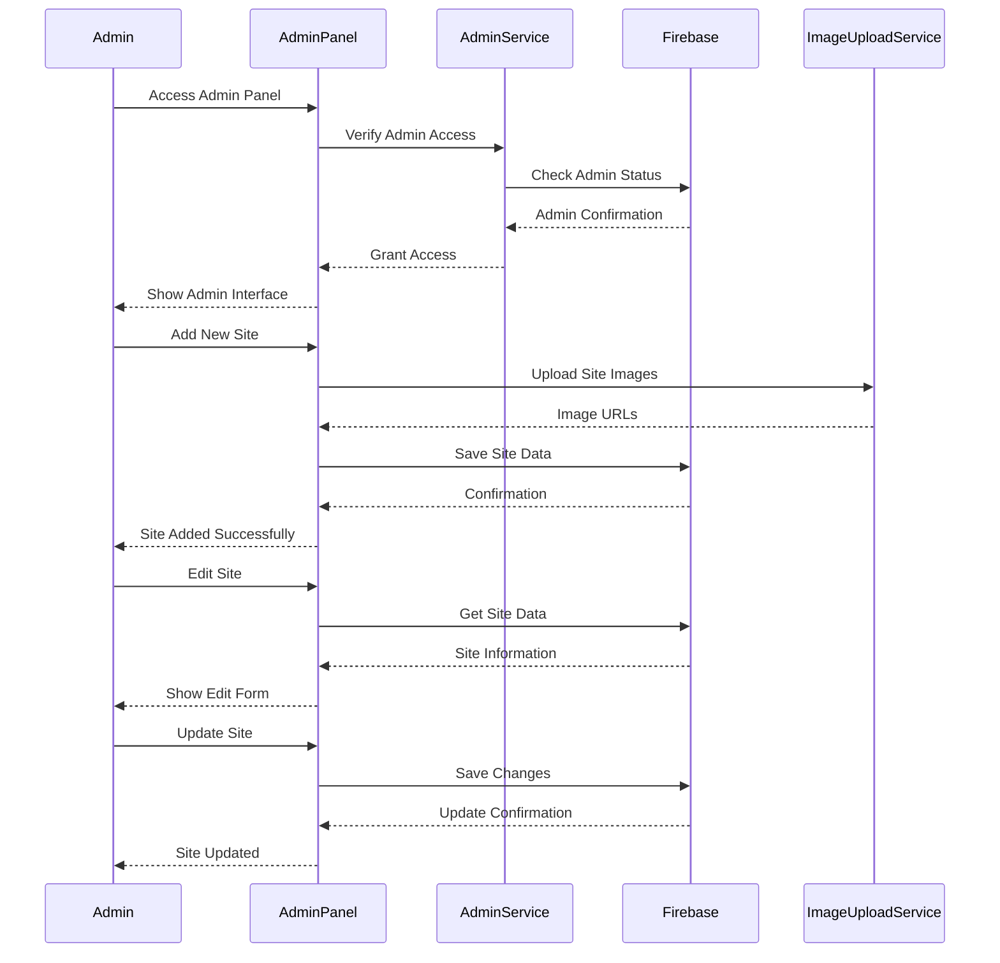
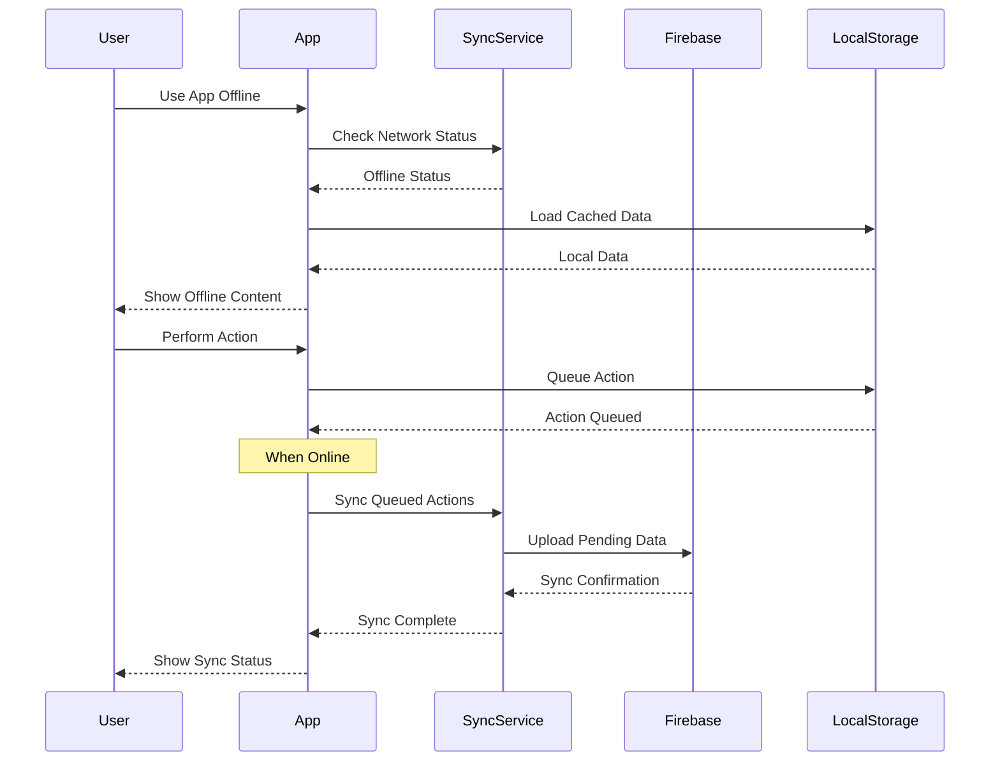

# Sri Heritage App - UML Diagrams

## 1. Use Case Diagram

```mermaid
graph TB
    %% Actors
    User((User))
    Admin((Admin))
    Guest((Guest))
    System((System))
    
    %% Use Cases for User
    User --> UC1[Register Account]
    User --> UC2[Login]
    User --> UC3[Browse Heritage Sites]
    User --> UC4[View Site Details]
    User --> UC5[Get Directions]
    User --> UC6[Mark Site as Favorite]
    User --> UC7[Mark Site as Visited]
    User --> UC8[Plan Visit]
    User --> UC9[Chat with AI Assistant]
    User --> UC10[View Chat History]
    User --> UC11[Participate in Forum]
    User --> UC12[Share Site Information]
    User --> UC13[View Gallery]
    User --> UC14[Read Reviews]
    User --> UC15[Write Reviews]
    User --> UC16[Book Ride]
    User --> UC17[Access Offline Content]
    User --> UC18[Update Profile]
    User --> UC19[Reset Password]
    User --> UC20[Logout]
    
    %% Use Cases for Admin
    Admin --> UC21[Manage Heritage Sites]
    Admin --> UC22[Add New Site]
    Admin --> UC23[Edit Site Information]
    Admin --> UC24[Upload Site Images]
    Admin --> UC25[Manage Site Gallery]
    Admin --> UC26[View Analytics]
    Admin --> UC27[Monitor User Activity]
    Admin --> UC28[Manage Site Categories]
    Admin --> UC29[Update Site Ratings]
    Admin --> UC30[Access Admin Panel]
    
    %% Use Cases for Guest
    Guest --> UC3
    Guest --> UC4
    Guest --> UC13
    Guest --> UC14
    Guest --> UC2
    
    %% Use Cases for System
    System --> UC31[Authenticate User]
    System --> UC32[Calculate Distance]
    System --> UC33[Generate Route]
    System --> UC34[Sync Data]
    System --> UC35[Process AI Chat]
    System --> UC36[Store Chat History]
    System --> UC37[Handle Offline Mode]
    System --> UC38[Send Notifications]
    
    %% Include relationships
    UC1 -.-> UC31
    UC2 -.-> UC31
    UC5 -.-> UC32
    UC5 -.-> UC33
    UC9 -.-> UC35
    UC9 -.-> UC36
    UC21 -.-> UC31
    UC22 -.-> UC31
    UC23 -.-> UC31
    UC25 -.-> UC31
    UC26 -.-> UC31
    
    %% Extend relationships
    UC4 -.-> UC6
    UC4 -.-> UC7
    UC4 -.-> UC8
    UC4 -.-> UC12
    UC4 -.-> UC15
    UC4 -.> UC13
    UC4 -.> UC14
    UC9 -.> UC10
    UC22 -.> UC25
    UC23 -.> UC25
```

## 2. Class Diagram

```mermaid
classDiagram
    %% Core Entities
    class User {
        +String uid
        +String email
        +String displayName
        +String photoURL
        +Date createdAt
        +Date lastLoginAt
        +getCurrentUser()
        +signUp(data)
        +signIn(data)
        +signOut()
        +updateProfile(updates)
    }
    
    class HeritageSite {
        +Number id
        +String name
        +String description
        +String location
        +Number latitude
        +Number longitude
        +String category
        +String image
        +String[] gallery
        +String openingHours
        +String entranceFee
        +Number rating
        +String historicalPeriod
        +String significance
        +getSitesFromFirestore()
        +calculateDistance()
    }
    
    class ChatSession {
        +String sessionId
        +String userId
        +Date createdAt
        +Date lastActivity
        +ChatMessage[] messages
        +createSession()
        +addMessage(message)
        +getHistory()
    }
    
    class ChatMessage {
        +String id
        +String text
        +String sender
        +Date timestamp
        +Boolean isLoading
        +sendMessage()
        +processResponse()
    }
    
    class Review {
        +Number id
        +String author
        +String avatar
        +Number rating
        +Date date
        +String comment
        +Number helpful
        +AspectRating[] aspectRatings
        +submitReview()
        +updateRating()
    }
    
    class ForumPost {
        +String id
        +String title
        +String content
        +String authorId
        +Date createdAt
        +String[] tags
        +Number likes
        +Comment[] comments
        +createPost()
        +addComment()
    }
    
    class Admin {
        +String email
        +String role
        +Boolean isAdmin
        +manageSites()
        +viewAnalytics()
        +accessAdminPanel()
    }
    
    %% Service Classes
    class AuthService {
        -User currentUser
        -Array authStateListeners
        +onAuthStateChanged(callback)
        +signUp(data)
        +signIn(data)
        +signOut()
        +sendPasswordResetEmail(email)
        +updateUserProfile(updates)
    }
    
    class FirebaseService {
        +FirebaseApp app
        +Auth auth
        +Firestore firestore
        +Storage storage
        +initialize()
        +getSitesFromFirestore()
        +uploadImage(file)
    }
    
    class ChatService {
        +String apiKey
        +Boolean isInitialized
        +initialize()
        +sendMessage(message)
        +processAIResponse()
    }
    
    class DistanceCalculator {
        +calculateDistance(lat1, lon1, lat2, lon2)
        +generateRoute(start, end)
        +getUserLocation()
    }
    
    class ImageUploadService {
        +uploadImage(imageFile)
        +deleteImage(imageUrl)
        +resizeImage(image)
    }
    
    %% UI Components
    class MainApp {
        +User user
        +String activeTab
        +String currentScreen
        +SiteData selectedSite
        +Number[] favoriteSites
        +Number[] visitedSites
        +Number[] plannedSites
        +Boolean offlineMode
        +handleNavigateToSite(site)
        +toggleFavorite(siteId)
        +handleVisitStatusChange(siteId, status)
    }
    
    class SiteInformationPage {
        +SiteData site
        +Boolean isFavorite
        +Boolean isVisited
        +Boolean isPlanned
        +Boolean offlineMode
        +Location userLocation
        +String calculatedDistance
        +handleGetDirections()
        +handleShare()
        +handleSubmitReview()
    }
    
    class ChatScreen {
        +ChatMessageUI[] messages
        +Boolean isLoading
        +String inputText
        +Boolean showHistoryModal
        +sendMessage()
        +loadChatHistory()
        +createNewChat()
    }
    
    class AdminPanel {
        +String activeTab
        +Site selectedSite
        +Boolean isGalleryModalVisible
        +Boolean isEditModalVisible
        +handleEditSite(site)
        +handleManageGallery(site)
        +handleSiteAdded()
    }
    
    %% Relationships
    User ||--o{ HeritageSite : visits
    User ||--o{ ChatSession : creates
    User ||--o{ Review : writes
    User ||--o{ ForumPost : creates
    User ||--o{ HeritageSite : favorites
    
    HeritageSite ||--o{ Review : has
    HeritageSite ||--o{ ChatMessage : discussed_in
    
    ChatSession ||--o{ ChatMessage : contains
    
    Admin ||--o{ HeritageSite : manages
    
    AuthService ||--|| User : authenticates
    FirebaseService ||--|| HeritageSite : stores
    ChatService ||--|| ChatMessage : processes
    DistanceCalculator ||--|| HeritageSite : calculates_for
    
    MainApp ||--|| SiteInformationPage : navigates_to
    MainApp ||--|| ChatScreen : contains
    MainApp ||--|| AdminPanel : contains
    
    SiteInformationPage ||--|| HeritageSite : displays
    ChatScreen ||--|| ChatService : uses
    AdminPanel ||--|| HeritageSite : manages
```

## 3. Sequence Diagrams

### 3.1 User Authentication Flow



### 3.2 Heritage Site Navigation Flow



### 3.3 AI Chat Flow



### 3.4 Admin Site Management Flow



### 3.5 Offline Mode Flow



## 4. System Architecture Overview

The Sri Heritage App follows a modern React Native architecture with the following key components:

### Core Features:
- **Authentication System**: Firebase Auth with user management
- **Heritage Site Management**: CRUD operations for cultural sites
- **AI Chat Assistant**: DeepSeek R1 integration for heritage guidance
- **Location Services**: GPS integration for directions and distance calculation
- **Admin Panel**: Comprehensive site management interface
- **Offline Support**: Local storage and sync capabilities
- **Image Management**: Gallery and image upload functionality
- **Review System**: User ratings and feedback
- **Forum System**: Community discussions

### Technical Stack:
- **Frontend**: React Native with TypeScript
- **Backend**: Firebase (Auth, Firestore, Storage)
- **AI**: DeepSeek R1 ChatBot API
- **Maps**: React Native Maps with Google Maps
- **UI**: Custom UI components with shadcn/ui
- **State Management**: React hooks and context
- **Storage**: AsyncStorage for local data

This architecture provides a scalable, maintainable solution for showcasing Sri Lanka's cultural heritage with modern mobile app capabilities. 